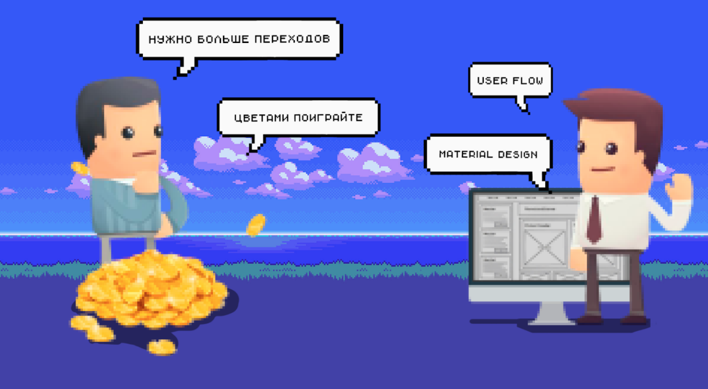
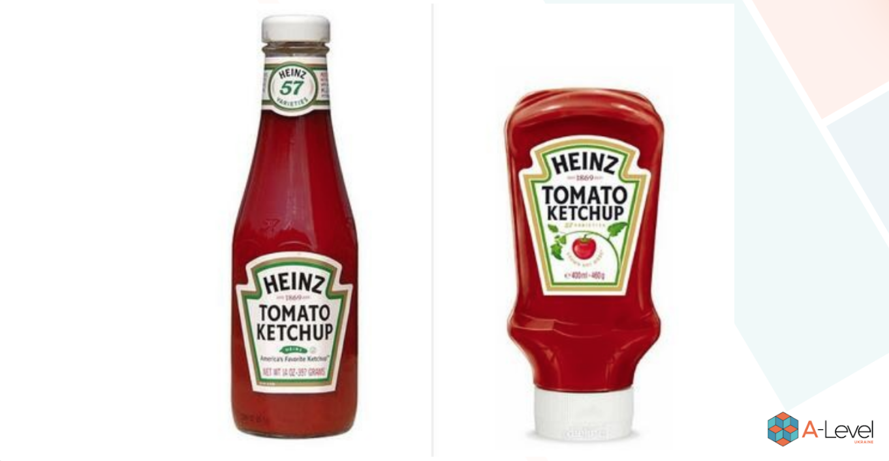
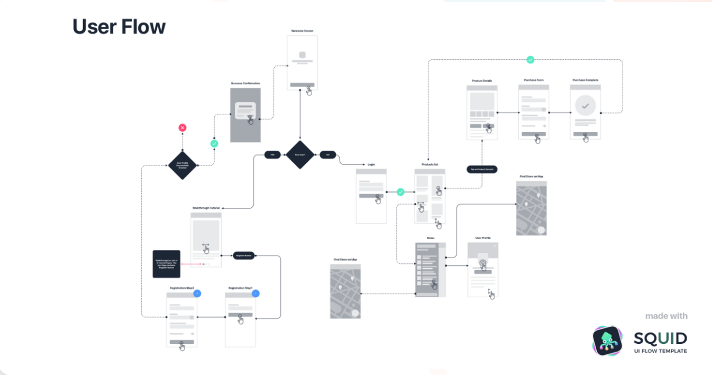
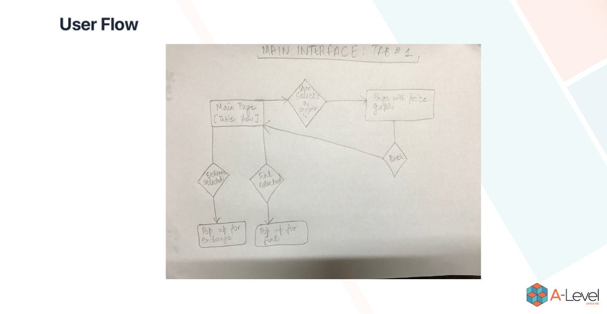
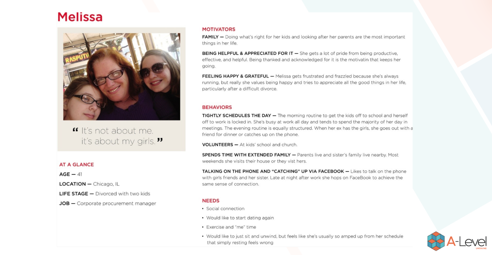
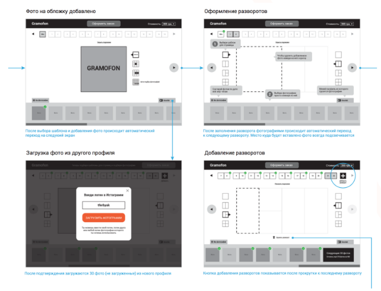
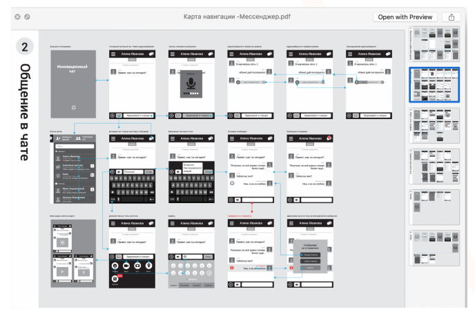

# User Flow

## User flow mobile app. Realtimeboard.

## Что такое UX & UI?

## Что и зачем?

**UX** — это User Experience (дословно: «опыт пользователя»). То есть это то, какой опыт/впечатление получает пользователь от работы с вашим интерфейсом. Удается ли ему достичь цели и на сколько просто или сложно это сделать.

**UI** — это User Interface (дословно «пользовательский интерфейс») — то, как выглядит интерфейс и то, какие физические характеристики приобретает. Определяет, какого цвета будет ваше «изделие», удобно ли будет человеку попадать пальцем в кнопочки, читабельным ли будет текст и тому подобное…

**UX/UI** дизайн — это проектирование любых пользовательских интерфейсов в которых удобство использования так же важно как и внешний вид.

## UX подход

Чек-лист по дизайну мобильного приложения:

- Понимание чувств пользователей (изучение аудитории)
-
- Определение проблемы (определение потребностей пользователей)
-
- Создание идей (генерация идей для дизайна)
-
- Прототипы (превращение идей в конкретные примеры)
-
- Тест (оценка дизайна)

## И так сойдет, или зачем нужна User Flow?

Отсутствие приводит к:

1. Плохо видна связь между экранами и можно упустить много важных деталей.
2. Приходится потом тратить много времени на объяснения клиенту и разработчикам как это все работает.

**Пы. Сы.** Можно запилить крутой интерактивный прототип (спасибо Invision/Marvel), но он не позволит увидеть сразу общую логику работы и пройтись по основным сценариям.
Придется долго-долго клацать, а потом все равно будете рисовать схему.  Смиритесь :)

## Виды карт навигации

1. **Общая карта(User Flow)** - это гибрид классической блок-схемы и элементов визуального интерфейса.
2. **Карта пути пользователя (User Journey map)** - как журнал,     в котором пользователь записывает свои чувства, неудачи и успехи. Oбычно линейны, так как описывают различные аспекты достижения конкретных задач.

## Из чего состоит User flow

- **Прямоугольники** – используются для представления экранов;
- **Ромбы** – используются для условий (например, нажатие кнопки входа в систему, свайп влево, увеличение);
- **Стрелки** – соединяют экраны и условия вместе.

## Примеры user flow

Сколько дизайнеров, столько и вариантов реализации

https://goo.gl/uX56cw

## Советы по созданию User Flow

## Персоны

**Персона** – это вымышленный персонаж, который дизайнеры создают как своего рода стереотип пользователя. Он представляет типичных пользователей, их цели, мотивации, разочарования и навыки. Другая информация, такая как демография и образование, дополняет персону. В зависимости от объема проектов дизайнеры будут генерировать несколько разных персонажей, чтобы охватить как можно большую часть аудитории. Создание персоны помогает дизайнерам сопереживать пользователям и демонстрировать полное понимание того, кто они и чего они хотят достичь.

## Эскизы экранов (Wireframes)

После того, как вы завершили проектировать user-flow для всех сценариев, вы начинаете работать с эскизами всех экранов.

**Wireframes** — это, по сути, быстрые наброски вашего приложение. Эскиз, схема того, где будут располагаться изображения, ярлыки, кнопки и прочее. Это грубый эскиз того, как ваше приложение должно работать.

Используй хорошо проработанный прототип, подписывай все экраны и добавляй комментарии которые помогут лучше понять логику всем участникам команды (менеджерам и программистам).

Если сценариев много, и они сложные, лучше их объединять в отдельные блоки, или размещать на отдельных листах (если потом документ со сценариями будет сохраняться как PDF).

